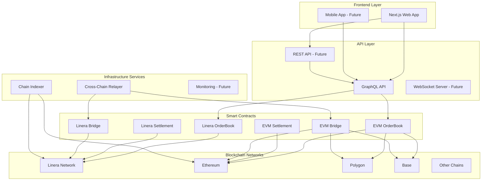

#  AxelarX Project Analysis & Development Plan

## Executive Summary

**AxelarX** is a sophisticated cross-chain decentralized exchange (DEX) built on Linera's microchain architecture with EVM compatibility. The project has a solid foundation with a fully functional frontend, deployed EVM contracts, and comprehensive integration code. However, several critical issues need attention, and significant features remain to be implemented.

---

## 1. Current State Analysis

### ✅ What's Working Well

#### Frontend Application ([`frontend/`](frontend/))

- **Status:** Fully functional with mock data
- **Stack:** Next.js 14, TypeScript, Tailwind CSS, React Query, Zustand
- **Features:**
  - Complete trading interface with real-time order book
  - Advanced charting (Lightweight Charts/TradingView)
  - Portfolio management dashboard
  - Market analytics (volume profile, order flow, sentiment)
  - Bridge UI for cross-chain transfers 
  - All UI components with animations and responsive design

#### Smart Contracts

**EVM Contracts** ([`evm-contracts/`](evm-contracts/)):

- ✅ **Deployed:** Local Hardhat network (Chain ID: 31337)
- ✅ **Contracts:**
  - `AxelarXOrderBook.sol` - Central Limit Order Book
  - `AxelarXSettlement.sol` - Trade settlement engine
  - `AxelarXBridge.sol` - Multi-chain bridge (Ethereum, Polygon, Arbitrum, Base)
  - `MockERC20.sol` - Test tokens (WBTC, WETH, USDT, USDC)
- ✅ **Integration:** Frontend hooks and EVM client ready

**Linera Contracts** ([`contracts/`](contracts/)):

- ✅ **Implemented:** OrderBook, Settlement, Bridge contracts in Rust
- ⚠️ **Issue:** WASM compilation errors (dependency conflicts)
- ⚠️ **Issue:** Linera CLI Windows compatibility problems

#### Integration Layer

- ✅ GraphQL client ([`frontend/lib/graphql/client.ts`](frontend/lib/graphql/client.ts))
- ✅ Contract client libraries ([`frontend/lib/contracts/`](frontend/lib/contracts/))
- ✅ React hooks for trading ([`frontend/hooks/`](frontend/hooks/))
- ✅ Automatic fallback to mock data when contracts unavailable

#### Documentation

- Comprehensive README and deployment guides
- Implementation plans for future features
- Analysis and improvement documents

---

## 2. Critical Issues Requiring Immediate Attention

### 🔴 Priority 1: Contract Deployment Issues

#### Issue A: Linera Contract WASM Compilation

**Location:** [`Cargo.toml`](Cargo.toml) workspace dependencies

**Problem:** Dependencies (tokio, mio) conflict with WASM target

**Impact:** Cannot deploy Linera contracts

**Solution Required:**

```toml
# Fix in contracts/*/Cargo.toml
[dependencies]
tokio = { version = "1.0", default-features = false, features = ["rt", "sync"] }
# Remove or conditionally include networking features
```

#### Issue B: Linera CLI Windows Compatibility

**Problem:** Installation from source fails on Windows

**Impact:** Cannot run local Linera network

**Solutions:**

1. Use WSL2 (Windows Subsystem for Linux)
2. Use Docker container with pre-installed Linera
3. Wait for official Windows binaries

### 🟡 Priority 2: Testing & Security

#### Missing Comprehensive Tests

- Unit tests for contracts: **0% coverage**
- Integration tests: **Not implemented**
- Frontend tests: **Jest setup exists but no tests**

#### Security Audit

- No formal security audit
- Missing rate limiting
- No circuit breakers for extreme volatility
- Oracle price feed validation needed

### 🟡 Priority 3: Real-Time Features

#### GraphQL Subscriptions

- Currently using polling fallback
- WebSocket implementation incomplete
- Real-time order book updates delayed

---

## 3. Essential Features Needed

### 🚀 Phase 1: Production Readiness (Weeks 1-4)

#### 1.1 Fix Critical Deployment Issues 

- **Fix WASM compilation:** Update Cargo.toml dependencies
- **Linera CLI setup:** Document WSL/Docker workaround
- **Test EVM deployment:** Deploy to Base Sepolia testnet
- **Contract verification:** Verify on Basescan

**Files to modify:**

- [`contracts/orderbook/Cargo.toml`](contracts/orderbook/Cargo.toml)
- [`contracts/settlement/Cargo.toml`](contracts/settlement/Cargo.toml)
- [`contracts/bridge/Cargo.toml`](contracts/bridge/Cargo.toml)
- [`DEPLOYMENT_GUIDE.md`](DEPLOYMENT_GUIDE.md)

#### 1.2 Comprehensive Testing

- **Unit Tests:**
  - Contract tests (Rust test suite)
  - Frontend component tests (Jest + React Testing Library)
  - Utility function tests

- **Integration Tests:**
  - End-to-end order placement flow
  - Cross-chain settlement flow
  - Bridge deposit/withdrawal flow

**Files to create:**

- `contracts/*/tests/`
- `frontend/__tests__/`
- `tests/integration/`

#### 1.3 Security Hardening

- Implement rate limiting (per user/IP)
- Add circuit breakers (price deviation thresholds)
- Oracle price feed aggregation (multiple sources)
- Input validation improvements
- Event logging enhancements

**Files to modify:**

- [`evm-contracts/contracts/AxelarXOrderBook.sol`](evm-contracts/contracts/AxelarXOrderBook.sol)
- [`evm-contracts/contracts/AxelarXSettlement.sol`](evm-contracts/contracts/AxelarXSettlement.sol)

#### 1.4 Real-Time Data Implementation

- Implement GraphQL subscriptions properly
- WebSocket connection management
- Optimistic UI updates
- Connection retry logic

**Files to modify:**

- [`frontend/lib/graphql/client.ts`](frontend/lib/graphql/client.ts)
- [`frontend/hooks/useOrderBook.ts`](frontend/hooks/useOrderBook.ts)

---

### 🚀 Phase 2: Advanced Trading Features (Weeks 5-10)

#### 2.1 Advanced Order Types

**Implementation Plan:** See [`docs/implementation-plans/01-advanced-order-types.md`](docs/implementation-plans/01-advanced-order-types.md)

**Features:**

- Iceberg Orders (hide large orders)
- TWAP Orders (time-weighted execution)
- Trailing Stop Orders (dynamic stop-loss)
- OCO Orders (one-cancels-other)

**Files to create/modify:**

- `contracts/orderbook/src/advanced_orders.rs`
- `frontend/components/trading/AdvancedOrderForm.tsx`

#### 2.2 Margin Trading

**Implementation Plan:** See [`docs/implementation-plans/02-margin-trading.md`](docs/implementation-plans/02-margin-trading.md)

**Features:**

- Leverage trading (2x, 5x, 10x)
- Isolated and cross margin
- Liquidation engine
- Margin account management

**Files to create:**

- `contracts/margin/src/lib.rs`
- `frontend/components/margin/MarginTrading.tsx`
- `frontend/hooks/useMargin.ts`

#### 2.3 Risk Management Features

- Position size limits
- Leverage limits
- Circuit breakers
- Maximum slippage protection

---

### 🚀 Phase 3: Liquidity & Growth (Weeks 11-16)

#### 3.1 Liquidity Mining Program

**Implementation Plan:** See [`docs/implementation-plans/03-liquidity-mining.md`](docs/implementation-plans/03-liquidity-mining.md)

**Features:**

- Reward distribution system
- LP token issuance
- Tiered rewards (Bronze/Silver/Gold/Platinum)
- Claim interface

**Files to create:**

- `contracts/liquidity-mining/src/lib.rs`
- `frontend/components/liquidity/LiquidityMining.tsx`
- `frontend/hooks/useLiquidityMining.ts`

#### 3.2 Public REST API

**Implementation Plan:** See [`docs/implementation-plans/04-public-rest-api.md`](docs/implementation-plans/04-public-rest-api.md)

**Features:**

- Market data endpoints
- Trading API (place/cancel orders)
- Account API (balances, positions, history)
- WebSocket API for real-time data
- API key management
- Rate limiting tiers

**Files to create:**

- `api/` directory structure
- `api/src/routes/markets.ts`
- `api/src/routes/trading.ts`
- `api/src/websocket/server.ts`

---

### 🚀 Phase 4: User Experience Enhancements (Weeks 17-22)

#### 4.1 Mobile Application

- React Native app (iOS + Android)
- Core features: trading, portfolio, notifications
- Push notifications
- Biometric authentication

**Files to create:**

- `mobile/` directory
- React Native project structure

#### 4.2 Notification System

- Order fill notifications
- Price alerts
- Portfolio alerts (P&L thresholds)
- Multi-channel (email, SMS, push, in-app)

#### 4.3 Advanced Analytics

- Trading performance metrics (Sharpe ratio, drawdown)
- Market analytics (order flow, volume profile)
- Portfolio analytics (correlation, risk metrics)
- Tax reporting (FIFO, LIFO, HIFO)

---

### 🚀 Phase 5: Developer Ecosystem (Weeks 23-28)

#### 5.1 SDK Development

- TypeScript/JavaScript SDK
- Python SDK (for algorithmic traders)
- Rust SDK
- Code examples and tutorials

#### 5.2 Trading Bots & Automation

- Bot marketplace
- Visual bot builder
- Strategy templates
- Paper trading environment
- Backtesting integration

---

## 4. Infrastructure Improvements

### Monitoring & Observability

**Current:** Not implemented

**Needed:**

- Prometheus metrics collection
- Grafana dashboards
- Alerting (PagerDuty/Slack)
- Centralized logging (ELK stack)
- Distributed tracing

**Files to create:**

- `monitoring/prometheus.yml`
- `monitoring/grafana/dashboards/`
- `infra/docker-compose.yml`

### CI/CD Pipeline

**Current:** Manual deployment

**Needed:**

- GitHub Actions workflows
- Automated testing on PR
- Automated deployment on merge
- Contract verification automation

**Files to create:**

- `.github/workflows/test.yml`
- `.github/workflows/deploy.yml`

---

## 5. Recommended Quick Wins (Can Implement Immediately)

### Frontend Quick Wins

1. **Better Loading States:** Add skeletons and loading indicators
2. **Error Messages:** More user-friendly error handling
3. **Tooltips:** Add helpful tooltips throughout UI
4. **Dark Mode:** Already has dark theme, add toggle
5. **Keyboard Shortcuts:** Power user features
6. **Performance:** Optimize bundle size, lazy loading

### Contract Quick Wins

1. **Gas Optimization:** Review and optimize contract code
2. **Event Logging:** Enhance event emissions for better indexing
3. **Error Messages:** More descriptive error messages
4. **Input Validation:** Stricter validation on inputs

### Infrastructure Quick Wins

1. **Error Tracking:** Integrate Sentry
2. **Analytics:** Google Analytics or Mixpanel
3. **SEO:** Meta tags, sitemap generation
4. **CDN:** Static asset CDN setup

---

## 6. Architecture Diagram



---

## 7. Priority Matrix

| Feature | Priority | Effort | Timeline | Impact |

|---------|----------|--------|----------|--------|

| Fix WASM compilation | 🔴 Critical | Low | 1 week | High |

| Linera CLI setup | 🔴 Critical | Medium | 1 week | High |

| Comprehensive testing | 🟡 High | High | 4 weeks | High |

| Security audit prep | 🟡 High | Medium | 2 weeks | Critical |

| Real-time subscriptions | 🟡 High | Medium | 2 weeks | Medium |

| Advanced order types | 🟢 Medium | Medium | 4 weeks | Medium |

| Margin trading | 🟢 Medium | High | 8 weeks | High |

| Liquidity mining | 🟢 Medium | Medium | 6 weeks | High |

| Public REST API | 🟢 Medium | Medium | 4 weeks | Medium |

| Mobile app | 🔵 Low | High | 12 weeks | Medium |

---

## 8. Next Steps (Immediate Actions)

### Week 1: Critical Fixes

1. Fix WASM compilation issues in contract Cargo.toml files
2. Set up Linera CLI using WSL or Docker
3. Deploy EVM contracts to Base Sepolia testnet
4. Verify contracts on Basescan

### Week 2-3: Testing Foundation

1. Write unit tests for all contracts
2. Write integration tests for core flows
3. Set up CI/CD pipeline with automated testing
4. Achieve 80%+ test coverage

### Week 4: Security Hardening

1. Implement rate limiting
2. Add circuit breakers
3. Enhance oracle validation
4. Prepare for security audit

---

## 9. Success Metrics

### Technical Metrics

- **Uptime:** 99.9%+
- **API Latency:** <100ms average
- **Throughput:** 10,000+ TPS (Linera microchains)
- **Test Coverage:** 90%+
- **Error Rate:** <0.1%

### Business Metrics

- **Daily Active Users:** Track growth
- **Trading Volume:** Monitor monthly volume
- **Revenue:** Track fee income
- **User Retention:** 30-day retention rate

---

## 10. Files Requiring Immediate Attention

### Critical Files

- [`contracts/orderbook/Cargo.toml`](contracts/orderbook/Cargo.toml) - Fix WASM dependencies
- [`contracts/settlement/Cargo.toml`](contracts/settlement/Cargo.toml) - Fix WASM dependencies
- [`contracts/bridge/Cargo.toml`](contracts/bridge/Cargo.toml) - Fix WASM dependencies
- [`DEPLOYMENT_GUIDE.md`](DEPLOYMENT_GUIDE.md) - Add WSL/Docker instructions

### High Priority Files

- [`evm-contracts/contracts/AxelarXOrderBook.sol`](evm-contracts/contracts/AxelarXOrderBook.sol) - Add rate limiting, circuit breakers
- [`frontend/lib/graphql/client.ts`](frontend/lib/graphql/client.ts) - Implement subscriptions
- Test files (to be created)

---

## Conclusion

AxelarX has a **strong foundation** with a complete frontend, deployed EVM contracts, and comprehensive planning. The main blockers are:

1. **Linera contract deployment** (WASM compilation issues)
2. **Testing coverage** (currently minimal)
3. **Security hardening** (rate limiting, circuit breakers, audits)

Once these are addressed, the platform can proceed with advanced features like margin trading, liquidity mining, and mobile applications.

The project demonstrates excellent architecture and planning. With focused effort on the critical issues, AxelarX can become a production-ready, competitive DEX platform.